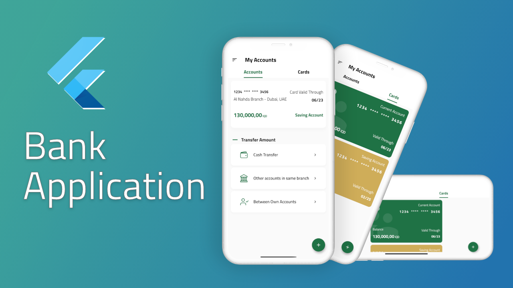

# Flutter Bank Application

Prototype application to demonstrate Bank Account Dashboard<br>
[](https://discord.com/invite/nWFnTqP)

<p align="center">
  
</p>

## Getting Started

To run the Furniture Marketplace Application project locally, follow these steps:

1. Clone the repository: `git clone git@github.com:Asad-Abbas-Coder/crypto_payments_application.git`
2. Open the project in your preferred IDE or code editor.
3. Ensure you have Flutter SDK installed.
4. Run `flutter pub get` to fetch the project dependencies.
5. Connect a device or start an emulator/simulator.
6. Run `flutter run` to launch the application.

## Architecture

This project is based on the Clean Architecture principles, which aim to create a scalable and maintainable codebase. The core architecture consists of three layers: presentation, domain, and data, providing separation of concerns and testability.

## Contributing

Contributions are welcome! Please follow the steps below to contribute:

1. Fork the repository.

2. Create a new branch:

    ```bash
        git checkout -b your-feature-branch
    ```

3. Commit your changes:

    ```bash
        git commit -m "Add your detailed message"
    ```

4. Push to the branch:

    ```bash
        git push origin your-feature-branch
    ```

5. Create a merge request for **dev** branch and assign the reviewer

## License

This project is licensed under the [MIT License](LICENSE). You are free to use, modify, and distribute this project as per the terms of the license.
